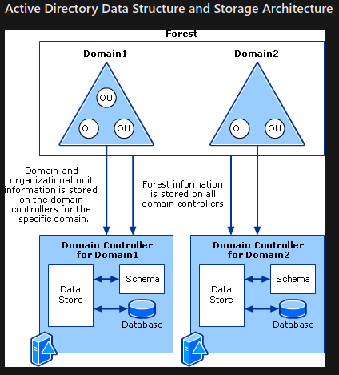
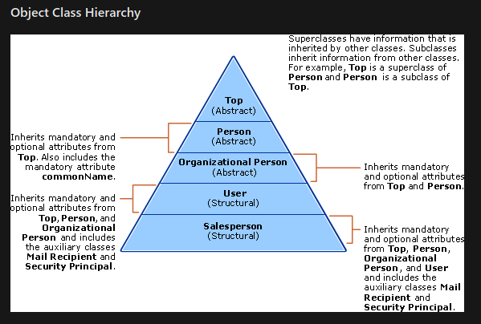
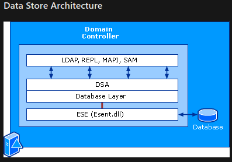

Active_Directory

# Active Directory
Source: https://docs.microsoft.com/en-us/windows-server/identity/ad-ds/get-started/virtual-dc/active-directory-domain-services-overview
#activedirectory #ad

- **Schema** \- defines classes of objects & attributes in directory, the constraints & limits on instances of objects, and format of names
- **Global Catalog** \- contains info about every object in directory. Allows users/admins to find directory info regardless of which domain in directory holds the data
- **Query/Index Mechanism** \- users can publish/find objects & properties
- **Replication Service** \- distributes directory data across a network

# AD Structure and Storage
Source: [https://docs.microsoft.com/en-us/previous-versions/windows/it-pro/windows-server-2003/cc759186(v=ws.10)](https://docs.microsoft.com/en-us/previous-versions/windows/it-pro/windows-server-2003/cc759186%28v=ws.10%29 "https://docs.microsoft.com/en-us/previous-versions/windows/it-pro/windows-server-2003/cc759186(v=ws.10)")
*Pertains to Win2003- Win2012R2*

- Objects = users, computers, devices, etc.
    - Used to store info in hte directory
    - All objects are defined in the schema
    - Domains and computers are each represented as objects in AD
    - **Everything that is stored in AD is stored as an Object**
- Logical Structure = secure hierarchical containment Structure
    - Forest & Domain are basis of logical Structure
- **Forest** \- security boundaries of logical structure which can provide data & service autonomy & isolation in an org
    - Can reflect site & group identities & remove dependencies on physical topology
- Domains can be structured in a forest to provide data & service autonomy (but not isolation) & optimize Replication
- Directory is implemented through a physical structure of a database stored on all DCs in a forest
- Data Store consists of both services & physical files

## Structure & Storage Architecture

- A **forest** defines a single directory & represents a security boundary
	- *Definition*: highest level of the logical structure hiearchy - representing a single self-contain directory
	- A security boundary, which means admins in a forest have complete control over all access to info in that is stored inside the forest & to DCs used to implement the forest
- **Forests** contain **domains**
- **Schema** provides object definitions used to create objects stored in the directory
- **Data Store** \- portion of directory that manges storage/retrieval of data on each DC

- **Domains** \- partition directory into smaller sections within a single forest
    - Benfits of Partition: control over data replication
    - *Definition*: partition information stored in directory into smaller portions (more efficient storage on DCs & greater admin control over replication)
    - Data relevant to entire forest is replicated to all DCs - data relevant only to specific domain is replicated only to DCs in that particular domain
- **OUs** \- group resources in a domain for management (i.e. group policy, admin control)
	- *Definition* - group resources (user accounts, computer accounts) to manage as one unit

### Schema
- Contains definitions for all objects (and associated attributes) used to store info in the directory
- 1 schema per forest
    - schema copies can exist on every DC in forest
- Data store relies on schema for: object definitions
    - Data store enforces data integrity with object definitions

Additional Info: https://docs.microsoft.com/en-us/previous-versions/windows/it-pro/windows-server-2008-r2-and-2008/cc771796(v=ws.10)
- Contains formal definitions of every object class that can be created in AD forest
- Containers:
	- **Classes** Container - store class definitions (`classSchema`)
	- **Attributes** Container - store attribute definitions (`attributeSchema`)

Main types of object Definitions:
**`classSchema` Objects** 
- Object definitions stored in the schema, used to define classes
	- as well as syntax of the data
- Define groups of attributes that have commonalities
- Can be nested to create more complex objects
- Example:
	- Object used to store user account needs to store info like: logon name, first name, last name, password
	- Create a **user** class that has a logon name attribute, first name attribute, last name attribute, & password attribute
	- Anytime new user is created, the directory uses the **user** class as definition, & every user account object created uses the attributes
- Defined in a schema separately from attributes, which enables a singgle attribute definition to be applied to many classes
- contain **`mustContain`** attributes and **`mayContain`** attributes
**`attributeSchema` Objects**
- Define individual attributes of a single object
- Each has its own attribute that specify: type of data, syntax, and required/optional
- Example
	- Using example from above... logon name, password attributes
- Defined in a schema separately from classes, which enables a singgle attribute definition to be applied to many classes
- Attributes are `attributeSchema` objects
- Each `attributeSchema` object is an instance of the **`attributeSchema`** class & has its own attributes

#### [What is AD Schema?](https://docs.microsoft.com/en-us/previous-versions/windows/it-pro/windows-server-2003/cc784826(v=ws.10))
*Target: Win2003 - Win2012R2*
- Objects are data structures that consist of multiple attributes that store both data & related metadata
	- Object definition is association of various attributes used to describe characteristics of an object
- Attributes are objects, and schema contains a definition of each one
	- contain data taht defines info stored in an object or another attribute
	- Can be required or optional
	- Object definition is association of various attributes used to describe characteristics of an object
- **Linked Attributes** - make it possible to associate one object with another object
	- represents an interobject, distinguished-name reference
	- Occur in pairs: forward link & backward link (back link)
	- Forward link = *member*
	- Backward Link = *member of*

#### [How does the AD Schema Work?](https://docs.microsoft.com/en-us/previous-versions/windows/it-pro/windows-server-2003/cc773309(v=ws.10))
*Target: Win2003 - Win2012R2*
- **Schema** is stored in the **directory** (in it's own partition)
	- stores class information, but does not store actual objects derived from the class
- schema is replicated among all domain controlelrs in the forest
- Any change made to schema is replicated to every DC in the forest
- **Classes** - categories of object definitions that act as blueprints when a new object is created
- Object definitions are created by nesting classes inside one another
- **Subclass** - a class nested inside a class
- **Superclass** - parent class of a subclass
- **Object Identifiers** - unique numeric values granted by various issuing authorities to identify data elements, syntaxes and other parts of distributed applications

Object Class Hiearchy:

#### [Schema Tools & Settings](https://docs.microsoft.com/en-us/previous-versions/windows/it-pro/windows-server-2003/cc757747(v=ws.10))
- AD Schema Tools: `adsiedit.exe`, `csvde.exe`, AD Users & Computers (`dsa.msc`), `ldifde.exe`, `ntdsutil.exe`, AD Schema Snap-in (`schmmgmt.msc`)

### Data Store
- Provide directory services to directory clients
- Consist of:
	- Four Interfaces: provide way for directory clients or directory servers to communicate with the **Data Store**
		- LDAP - Lightweight Directory Access Protocol
		- REPL - Replication and DC Management Interface
		- MAPI - Messaging API
		- SAM - Security Accounts Manager
	- Three Service Components
		- DSA - Directory System Agent (`Ntdsa.dll`) - provides interfaces which directory clients/servers gain access to directory database
			- enforce directory semantics, maintains the schema, guarantees object identity & enforces data types on attributes
		- Database Layer
			- API residing in `Ntdsa.dll` - provides interface between apps in directory database and prtects DB from direct interaction with apps
			- calls are never made directly to database from app - go through the database layer
			- provides obstraction of object hierarchy (since databse is flat with no hierarchical namespace)
		- ESE - Extensible Storage Engine (`Esent.dll`) - communicates directly with individual records in directory database on object's relative distinguished name attribute
	- Directory Database (for data storage)- stores directory info in single file and uses log files to temp write uncommited transactions

## AD Structure & Storage Components
- Forests, Domains, OUs = logical structure of AD, defined during install
- DNS - components to locate DCs using DNS Naming schemes
- Schema - component inside the directory, definitions of objects to store info in the directory. Composed of:
	- `classSchema` objects
	- `attributeSchema` objects
- Data Store - 3 components:
	- Interfaces needed to access
	- Services that perform operations to read/write data to database
	- Database itself

## DNS Support
#dns #activedirectory #ad
- Used to locate/discover domain controllers
- DNS is used during principal AD operations
    - (Domain-joined) comps use DNS to locate AD DCs
    - DCs use DNS to locate eacah other
- **Principal AD Operations**: authentication, updating, searching
- DC needed for initial authentication (of new workstation) of workstation & user *as well as* subsequent authorization for files/resources
- [DNS GPO Settings](https://docs.microsoft.com/en-us/previous-versions/windows/it-pro/windows-server-2008-r2-and-2008/dd197486(v=ws.10))

### DNS Components
**Locator**
- Enables client to locate a DC
- implemented in the Net Logon service
- Contains IP/DNS-compatible & Windows NT 4.0 compatible locators
**AD Domain Names in DNS**
- Each AD Domain has a DNS Domain Name (`testnetwork.net`)
- Every Domain joined comp has a DNS name (`server1.testnetwork.net`)
- Domains and computers are represented as nodes in DNS
**AD DNS Objects**
*When DNS Data is stored in AD*:
- each DNS zone is an AD container object (class `dnsZone`)
- `dnsZone` Object:
	- contains a DNS node object (class `dnsNode`) for every unique name in the zone
	- Each `dnsNode` object has a `dnsRecord` multivalued attributes (1 value for each resource record)]

# Domain Controller Roles
#dc #domaincontroller
Source: https://docs.microsoft.com/en-us/previous-versions/windows/it-pro/windows-server-2003/cc786438(v=ws.10)
*Pertains to Win2003- Win2012R2*

-Domain Controller (DC) server running Windows Server OS & has Active Directory (AD) Domain Services (AD DS) installed
- *Default*: DC stores 1 domain directory partition, plus schema and config directory partitions for entire forest
	- Domain directory partition consists of info about domain
- Stores objects for domains in which it is installed (not all domains in the forest)

## Global Catalog Servers
- Stores the objects from all domains in the forest
- Stores its own full, writable domain replica (all objects and attributes), plus partial read only replica of every other domain in forest
	- Limited set of attributes stored in partial replica of domain for each object not in domain which global catalog server is authoritative
- Global catalog is built and updated automatically by AD DS replication
	- Object attributes that are replicated to the Global Catalog identified in schema as PAS (partial attribute set)
	- Can add/remove attributes stored in global catalog
- Allows clients to search AD DS without having to be referred from server to server until DC that has domain directory partitioning is found
- First DC in a forest is created as Global Catalog Server

## Operations Masters
- Designated to perform specific tasks
	- Ensure consistency, eliminate potentials for conflict
- AD DS Defines 5 Roles:
	- Must occur only only 1 DC in forest:
		- Schema Master
		- Domain Naming Master
	- Must occur only on 1 DC in domain:
		- PDC (Primary Domain Controller) Emulator
		- Infrastructure Master
		- RID (Relative ID) Master

# Understanding Trusts
Source: https://docs.microsoft.com/en-us/previous-versions/windows/it-pro/windows-server-2008-r2-and-2008/cc771568(v=ws.10)
This link has many more Links.  The ones I focused on were **Understanding Trusts**, **Understanding Trust Types**, **Understanding Trust Direction** and **Understanding Trust Transitivity**.

## Understanding Trusts
Source: https://docs.microsoft.com/en-us/previous-versions/windows/it-pro/windows-server-2008-r2-and-2008/cc731335(v=ws.10)
*Target OS: Win2000, Win2003, Win2008*

- All trusts are *transitive*, *two-way* trusts = both domains in a trust relationship are trusted
	- A <--> B <--> C
	- If A trusts B and B trusts C, users from C can access A
- Only Domain Admins (membership group) can manage trust relationships

### Trust Protocols
- Win2008 uses Kerberos v5 or NTLM
- Kerberos v5 default from Windows 2000-2008
- If Kerberos not supported, default to NTLM

### Trusted Domain Objects (TDOs)
- Objects that represent each trust relationship within a particular domain
- Unique TDO is created and stored in its domain (in System container) each time a trust is established
- TDO attributes include: trust transitivity, type, and reciprocal domain names
- Forest Trust TDOs store attributes to ID all trust namespaces from partner forests
	- Attributes include: domain tree name, UPN suffixes, SPN suffixes, and SID namespaces

## Understanding Trust Types
Source: https://docs.microsoft.com/en-us/previous-versions/windows/it-pro/windows-server-2008-r2-and-2008/cc730798(v=ws.10)
#ad #trusttypes
- All trust types can be cofnigured in *one-way* or *two-way* direction.

|Trust Type|Transitivity|Description|
|---|---|---|
|External|Nontransitive|Provide access to resources on NT 4.0 domain, or domain in separate forest not joined by forest trust|
|Realm| Either| Form a trust between non-Windows Kerberos realm and Win2008 domain|
|Forest| Transitive| Share resources between forests. If 2-way, auth requests are made in either forest can reach the other forest|
|Shortcut|Transitive|Improve logon times with Win2008 Server forests. Useful when 2 domains separated by 2 domain trees

Sources: [External Trusts](https://docs.microsoft.com/en-us/previous-versions/windows/it-pro/windows-server-2008-r2-and-2008/cc732859(v=ws.10))
[Shortcut Trusts](https://docs.microsoft.com/en-us/previous-versions/windows/it-pro/windows-server-2008-r2-and-2008/cc754538(v=ws.10))
[Realm Trusts](https://docs.microsoft.com/en-us/previous-versions/windows/it-pro/windows-server-2008-r2-and-2008/cc731297(v=ws.10))

- External trust - sometimes necessary when users need resources in NT domain, or domain located in separate forest not joined by forest trust
	- Security Principals from external domain can access resources in internal domain
- Shortcut Trust - shorten the path that authentication requests travel between domains located in separate domain trees
- Realm Trust - cross-platform interoperability w/ security services based on Kerberos v5

### Understanding Trust Directions
Source: https://docs.microsoft.com/en-us/previous-versions/windows/it-pro/windows-server-2008-r2-and-2008/cc731404(v=ws.10)
*Target: Win2008*

- **Trust Path** - series of trust relationships that authentication requests must follow between domains
	- Before user can access resource in another domain, DC security system has to figure out if trusting domain (domain w/resource user is trying to access) has trust relationship with user's domain
- **One-Way Trust** - (between domains A and B) users in Domain A can access resource in domain B, but B cannot access Domain A (i.e. A --> B)
- **two-Way Trust** - A <--> B
	- when child domain is created, 2-way transitive trust automatically created between parent and child

### Understanding Trust Transitivity
Source: https://docs.microsoft.com/en-us/previous-versions/windows/it-pro/windows-server-2008-r2-and-2008/cc754612(v=ws.10)
*Applies to: Win2008*
- **Transitivity** - determines if trust can be extended outside 2 domains which trust was formed
- **Transitive Trust** - flows to other domains in forest
	- flow upward through domain tree as it is formed
	- Authentication request follow trust paths
- **Non-transitive Trust** - can be 2-way or 1-way - restricted by 2 domains in trust relationship

# AD Replication Technologies
Source: https://docs.microsoft.com/en-us/previous-versions/windows/it-pro/windows-server-2003/cc776877(v=ws.10)
*Target: Win200-2012 R2*

- **Replication** - process by which changes that originate on one DC are automatically transferred to other DCs storing the same data
- Support the multimaster update capabilities of AD DCs

## Replication Topology
- **Topology** - current set of AD connections by which domain controllers in a forest communicate over LANs/WANs to sync directory partition replicas in common
	- Ensure transfer of changes to all replicas in forest without redundancy
- Dynamic, & adapts to network conditions and availability of DCs

# AD Search & Publication Technologies
Source: https://docs.microsoft.com/en-us/previous-versions/windows/it-pro/windows-server-2003/cc775686(v=ws.10)
*Target: Win2003-Win2012R2*
- **AD Search** - clients and services find data stored in directory.  ADSI (Services Interface) LDAP provider or LDAP API fulfill requests for directory objects
	- *Directory Client Application* - any app that is capable of searching for info stored in AD
	- *LDAP* - directory service specifying directory comms running over TCP/IP (or UDP). Enbles clients to query, create,update, delete info stored in directory service
	- *AD Database* - Structured data store to store info on objects
- **AD Service Publication** - enables services to provide info about selves in directory, and enables directory clients to search for services on network
	- *Service* - app that makes data or operations available to clients
	- *Client App* - application which runs on endpoint that uses a service
	- *KDC* - provides mechanism for authenticating services (using SPNs)
	- *Connection Point Object* - object in AD containing info about service. Needed to advertise & find available services.
	- *Service Account Object* - AD Object representing the whole security contexta servie runs & which SPN attribute resides
	- *SPN Attribute* - attribute w/unique name identifying instance of service associated w/logon account in which instance of service runs
